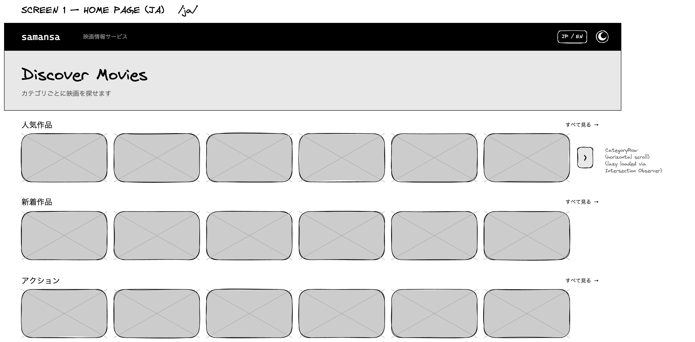
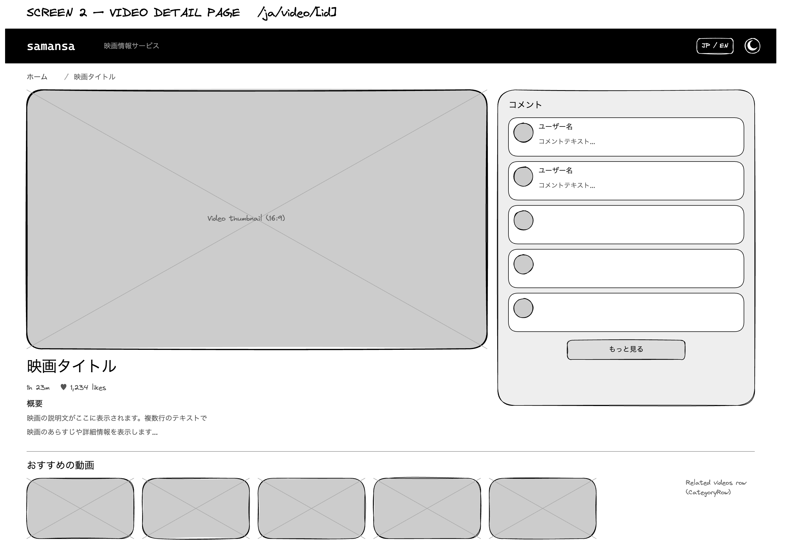
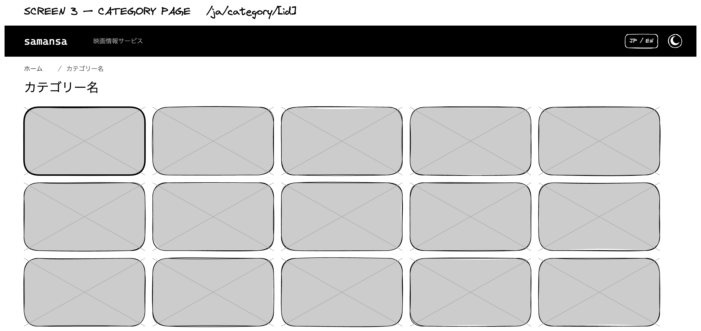
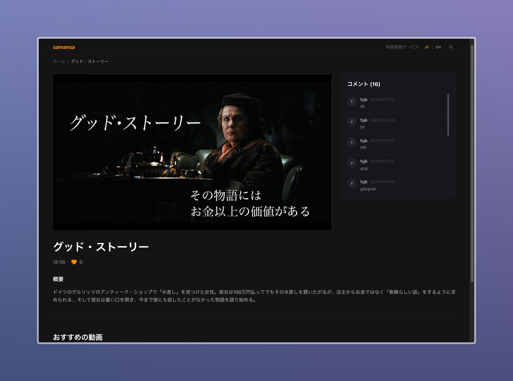
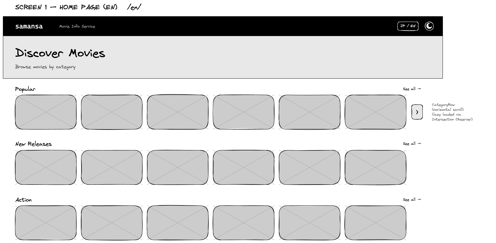
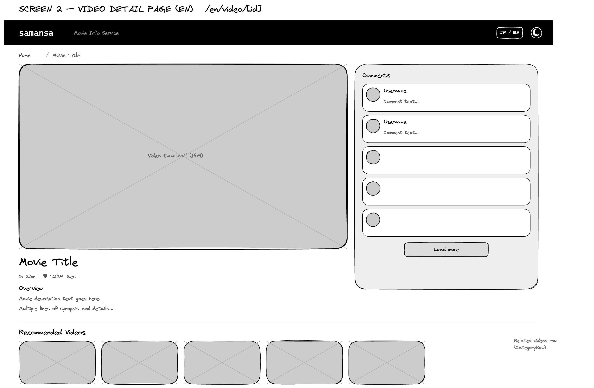
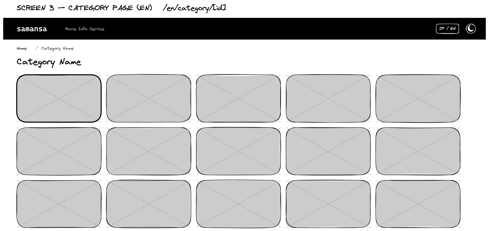
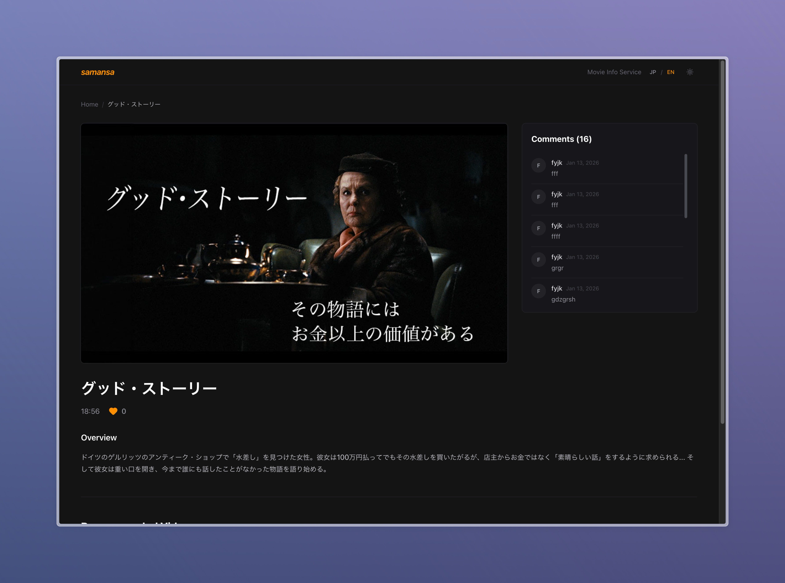

# 映画情報サービス - Samansa 技術課題 / コーディングテスト

カテゴリ別に映画を表示し、詳細やコメントを確認できるNext.jsアプリケーション。GraphQL APIを利用して映画データを取得し、トップページ、カテゴリ詳細ページ、映画詳細ページの3ページを提供します。


> **Note:** [English version](#movie-info-service---samansa-coding-challenge) is available below.

## 目次

- [設計概要](#設計概要)
- [ページとルーティング](#ページとルーティング)
- [ワイヤーフレーム](#ワイヤーフレーム)
- [スクリーンショット](#スクリーンショット)
- [GraphQL利用](#graphql利用)
- [主要な設計判断](#主要な設計判断)
- [セットアップと実行](#セットアップと実行)
- [技術スタック](#技術スタック)
- [インスピレーション・参考資料](#インスピレーション参考資料)

---

## 設計概要

### 定義された要件

仕様に基づき、以下の要件を特定し実装しました:

1. **トップページ** — カテゴリごとに映画サムネイルを表示。各カテゴリに「すべて見る」リンクでカテゴリ詳細ページへ遷移。映画サムネイルクリックで詳細ページへ遷移。
2. **カテゴリ詳細ページ** — そのカテゴリに属する映画サムネイルをグリッド表示。サムネイルクリックで詳細ページへ遷移。
3. **映画情報詳細ページ** — 映画のタイトル、説明、like数を表示。右サイドバーでコメント一覧を表示。
4. **GraphQL API** — `getHomeScreens`、`getCategory`、`getOriginalVideo`、`getVideoComments`の4つのクエリを使用。
5. **実践的な工夫** — getHomeScreensでカテゴリのみ取得し、各カテゴリの映画は後から lazy に取得する方式を採用。

---

## ページとルーティング

### URL構造

| ルート | 説明 |
|-------|------|
| `/[locale]` (例: `/ja`, `/en`) | トップページ。カテゴリ一覧と各カテゴリの映画サムネイル |
| `/[locale]/category/[id]` | カテゴリ詳細。そのカテゴリ内の映画のみ表示 |
| `/[locale]/video/[id]` | 映画詳細。タイトル、説明、like数、右サイドバーにコメント一覧 |

`middleware`により、ルートパス `/` はデフォルトロケール（`ja`）にリダイレクトされます。

### ナビゲーション

`lib/navigation.ts`でnext-intlの`createNavigation`を使用。`Link`、`useRouter`、`usePathname`、`redirect`を提供し、ロケールを保持した遷移を実現しています。

### ワイヤーフレーム

The wireframes for this project were created using [Excalidraw](https://excalidraw.com/).

#### トップページ



#### 映画詳細ページ



#### カテゴリ詳細ページ



### スクリーンショット

#### トップページ


#### 映画詳細ページ



#### カテゴリ詳細ページ


---

## GraphQL利用

### 使用クエリ一覧

| クエリ | 用途 | 呼び出し元 |
|-------|------|------------|
| **getHomeScreens** | 映画一覧ページ用のカテゴリ情報（id, name）を取得 | トップページ、カテゴリSSG、RelatedVideos |
| **getCategory** | カテゴリIDで映画一覧を取得 | カテゴリ詳細ページ、CategoryRow（クライアント） |
| **getOriginalVideo** | 映画IDで詳細（タイトル、説明、likeNum等）を取得 | 映画詳細ページ |
| **getVideoComments** | 映画IDでコメント一覧を取得 | CommentList（クライアント） |

### データ取得戦略

- **サーバーサイド:** トップページ、カテゴリ詳細、映画詳細の初期表示は`lib/graphql/server.ts`の関数経由でApollo Server Clientを使用。
- **クライアントサイド:** `CategoryRow`と`CommentList`はApollo Clientの`useQuery`で取得。CategoryRowは`IntersectionObserver`により、表示領域に入るまでフェッチを遅延（lazy load）。
- **実践的な工夫:** `getHomeScreens`はカテゴリ情報のみ取得。各カテゴリの映画は`getCategory`で必要に応じてフェッチ。これにより初期ロードが軽くなり、表示領域外のカテゴリのデータ取得を遅延できます。

### GraphQL エンドポイント

デフォルト: `https://develop.api.samansa.com/graphql`  
環境変数 `NEXT_PUBLIC_GRAPHQL_ENDPOINT` で上書き可能。

---

## 主要な設計判断

### 1. カテゴリ単位の遅延フェッチ

`getHomeScreens`でカテゴリのidとnameのみ取得し、各カテゴリの映画は`CategoryRow`が表示領域に入ったタイミングで`getCategory`を実行。初期表示の高速化と不要なAPIコールの削減を両立。

### 2. サーバー / クライアント Apollo の分離

- **サーバー:** RSC、generateMetadata、generateStaticParams向けに`apolloServerClient`を使用。`revalidate`オプションでキャッシュ制御。
- **クライアント:** `CategoryRow`、`CommentList`は`ApolloProvider`配下で`useQuery`を使用。

### 3. next-intl による国際化

日本語（ja）と英語（en）をサポート。`messages/`のJSONで翻訳を管理。`Link`や`redirect`は`lib/navigation.ts`経由で使用し、ロケールを自動付与。

### 4. 静的生成（SSG）の活用

`category/[id]/page.tsx`で`generateStaticParams`を用い、`getHomeScreens`で取得したカテゴリID一覧から事前ビルド。カテゴリページは静的HTMLとして配信可能。

### 5. テーマ対応

`next-themes`でダーク/ライトモードをサポート。`class`ストラテジーでTailwindのdark:修飾子と連携。

---

## セットアップと実行

### 前提条件

- Node.js 18以上
- npm / yarn / pnpm / bun のいずれか

### クイックスタート

```bash
# 依存関係のインストール
npm install

# 開発サーバーの起動
npm run dev

# ブラウザで http://localhost:3000 を開く
# ルートは自動的に /ja にリダイレクトされます
```

### その他のコマンド

```bash
# 本番ビルド
npm run build

# 本番サーバーの起動
npm run start

# リント
npm run lint

# GraphQL 型生成（クエリ変更時）
npm run codegen
```

### 環境変数（任意）

| 変数名 | 説明 | デフォルト |
|--------|------|------------|
| `NEXT_PUBLIC_GRAPHQL_ENDPOINT` | GraphQL API エンドポイント | `https://develop.api.samansa.com/graphql` |

---

## 技術スタック

| コンポーネント | 技術 |
|----------------|------|
| フレームワーク | Next.js 15 (App Router) |
| 言語 | TypeScript |
| スタイリング | Tailwind CSS 4 |
| データ取得 | Apollo Client (GraphQL) |
| 国際化 | next-intl |
| テーマ | next-themes |
| アイコン | lucide-react |
| フォント | next/font (Geist) |

---

<a id="インスピレーション参考資料"></a>

## インスピレーション・参考資料

### UI・機能の参考

UIデザインと機能の参考にした動画配信サービス：

- [Samansa](https://samansa.com/)
- [Netflix](https://www.netflix.com/)
- [Hulu](https://www.hulu.com/)
- [Amazon Prime Video](https://www.primevideo.com/)

### デザイン・ツール

- [Excalidraw](https://excalidraw.com/) — ワイヤーフレーム作成

### API・データ

- [Samansa GraphQL API (GraphiQL)](https://develop.api.samansa.com/graphiql) — 利用可能なクエリの確認・検証

### フレームワーク・ライブラリ

- [Next.js Documentation](https://nextjs.org/docs) — App Router、サーバーコンポーネント
- [next-intl](https://next-intl-docs.vercel.app/) — 国際化
- [Apollo Client](https://www.apollographql.com/docs/react/) — GraphQL クライアント
- [Tailwind CSS](https://tailwindcss.com/docs) — ユーティリティファーストCSS
- [Lucide React](https://lucide.dev/) — アイコン

---

# Movie Info Service - Samansa Coding Challenge

A Next.js application that displays movies by category, with detail pages and comment lists. It fetches data from a GraphQL API and provides three main pages: top (home), category detail, and movie detail.


> **Note:** [日本語版](#映画情報サービス---samansa-技術課題--コーディングテスト) is available at the top.

## Table of Contents

- [Design Overview](#design-overview)
- [Pages & Routing](#pages--routing)
- [Wireframes](#wireframes)
- [Screenshots](#screenshots)
- [GraphQL Usage](#graphql-usage)
- [Key Design Decisions](#key-design-decisions)
- [Setup & Running](#setup--running)
- [Tech Stack](#tech-stack)
- [Inspirations / References](#inspirations--references)

---

## Design Overview

### Requirements Defined

Based on the specification, the following requirements were identified and implemented:

1. **Top Page** — Display movie thumbnails by category. Each category has a "See all" link to the category detail page. Clicking a thumbnail navigates to the movie detail page.
2. **Category Detail Page** — Display movie thumbnails for that category in a grid. Clicking a thumbnail navigates to the detail page.
3. **Movie Detail Page** — Display the movie title, description, and like count. A right sidebar shows the comment list.
4. **GraphQL API** — Uses four queries: `getHomeScreens`, `getCategory`, `getOriginalVideo`, `getVideoComments`.
5. **Practical Improvement** — `getHomeScreens` fetches only category metadata; movies per category are fetched lazily via `getCategory` when the category row enters the viewport.

---

## Pages & Routing

### URL Structure

| Route | Description |
|-------|-------------|
| `/[locale]` (e.g. `/ja`, `/en`) | Top page. Category list and movie thumbnails per category |
| `/[locale]/category/[id]` | Category detail. Movies in that category only |
| `/[locale]/video/[id]` | Movie detail. Title, description, like count, comment list in sidebar |

The root path `/` redirects to the default locale (`ja`) via middleware.

### Navigation

`lib/navigation.ts` uses next-intl's `createNavigation` to provide `Link`, `useRouter`, `usePathname`, and `redirect` with locale-preserving navigation.

### Wireframes

The wireframes for this project were created using [Excalidraw](https://excalidraw.com/).

#### Top Page



#### Movie Detail Page



#### Category Detail Page



### Screenshots

#### Top Page


#### Movie Detail Page



#### Category Detail Page


---

## GraphQL Usage

### Queries Used

| Query | Purpose | Used By |
|-------|---------|---------|
| **getHomeScreens** | Fetch category metadata (id, name) for the movie list page | Top page, category SSG, RelatedVideos |
| **getCategory** | Fetch movie list by category ID | Category detail page, CategoryRow (client) |
| **getOriginalVideo** | Fetch movie details (title, description, likeNum, etc.) by movie ID | Movie detail page |
| **getVideoComments** | Fetch comment list by movie ID | CommentList (client) |

### Data Fetching Strategy

- **Server-side:** Top, category, and movie detail initial data via `lib/graphql/server.ts` with Apollo Server Client.
- **Client-side:** `CategoryRow` and `CommentList` use Apollo Client's `useQuery`. CategoryRow defers fetching until the section enters the viewport via `IntersectionObserver` (lazy load).
- **Practical improvement:** `getHomeScreens` returns only category info. Movies per category are fetched with `getCategory` on demand, reducing initial load and deferring off-screen category fetches.

### GraphQL Endpoint

Default: `https://develop.api.samansa.com/graphql`  
Override with `NEXT_PUBLIC_GRAPHQL_ENDPOINT`.

---

## Key Design Decisions

### 1. Lazy Fetch per Category

`getHomeScreens` fetches only category id and name. Each category's movies are fetched with `getCategory` when `CategoryRow` enters the viewport. Balances fast initial render with fewer unnecessary API calls.

### 2. Server / Client Apollo Split

- **Server:** `apolloServerClient` for RSC, generateMetadata, generateStaticParams. Uses `revalidate` for cache control.
- **Client:** `CategoryRow` and `CommentList` use `useQuery` under `ApolloProvider`.

### 3. Internationalization with next-intl

Supports Japanese (ja) and English (en). Translations in `messages/` JSON. `Link`, `redirect` via `lib/navigation.ts` to preserve locale.

### 4. Static Generation (SSG)

`category/[id]/page.tsx` uses `generateStaticParams` with category IDs from `getHomeScreens`. Category pages can be pre-rendered as static HTML.

### 5. Theme Support

`next-themes` provides dark/light mode. Uses `class` strategy with Tailwind's `dark:` modifier.

---

## Setup & Running

### Prerequisites

- Node.js 18+
- npm / yarn / pnpm / bun

### Quick Start

```bash
# Install dependencies
npm install

# Start development server
npm run dev

# Open http://localhost:3000 in your browser
# Root path redirects to /ja by default
```

### Other Commands

```bash
# Production build
npm run build

# Start production server
npm run start

# Regenerate GraphQL types (after query changes)
npm run codegen
```

### Environment Variables (Optional)

| Variable | Description | Default |
|----------|-------------|---------|
| `NEXT_PUBLIC_GRAPHQL_ENDPOINT` | GraphQL API endpoint | `https://develop.api.samansa.com/graphql` |

---

## Tech Stack

| Component | Technology |
|-----------|------------|
| Framework | Next.js 15 (App Router) |
| Language | TypeScript |
| Styling | Tailwind CSS 4 |
| Data Fetching | Apollo Client (GraphQL) |
| i18n | next-intl |
| Theme | next-themes |
| Icons | lucide-react |
| Fonts | next/font (Geist) |

---

## Inspirations / References

### UI Design & Functionality

Streaming services used as references for UI design and functionality:

- [Samansa](https://samansa.com/)
- [Netflix](https://www.netflix.com/)
- [Hulu](https://www.hulu.com/)
- [Amazon Prime Video](https://www.primevideo.com/)

### Design & Tools

- [Excalidraw](https://excalidraw.com/) — Wireframe creation

### APIs & Data

- [Samansa GraphQL API (GraphiQL)](https://develop.api.samansa.com/graphiql) — Explore and test available queries

### Frameworks & Libraries

- [Next.js Documentation](https://nextjs.org/docs) — App Router, Server Components
- [next-intl](https://next-intl-docs.vercel.app/) — Internationalization
- [Apollo Client](https://www.apollographql.com/docs/react/) — GraphQL client
- [Tailwind CSS](https://tailwindcss.com/docs) — Utility-first CSS
- [Lucide React](https://lucide.dev/) — Icons

